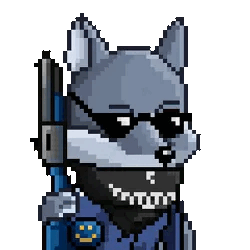
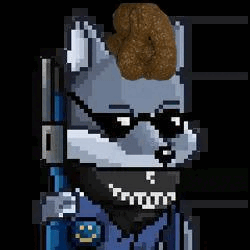
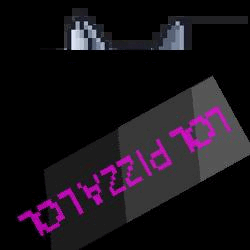

# NFT web scraper using selenium and beautiful soup, with a pillow based image manipulator to deface images with scatalogical humor :)

This is a python project I made, to create characters for my flappy bird clone, where you will get an avatar of a random shat on NFT picture. This is something I wanted to be dynamic in the game, but the workload was a bit much and also I have no idea what I am doing (what else is new)

## main.py
This file will go to this link: 

https://nftrade.com/marketplace?search=&sort=min_price_desc

Those are the listings of the <b>highest value NFTs</b> on the website. Annoyingly it uses Javascript to dynamically load elements, so the only way this can work is by using selenium and simulating an actual browser. apparently this is slow and bad but because of JS theres not much else you can do about this unless your a browser/internet wizz :cry:

It gets all the links to each NFT image that loads on immediate browser load (about 75 images), and saves it to a folder called NFT, which is created in the users main.py directory

This gives you all the NFT's you could dream of:

Inside the Paster Folder is the stuff I am a bit more fond of: 

## <b><u>Image manipulation</b></u>

LargeScalePaste.py - a mostly all purpose image manipulation module for speeding up the pasting of stuff onto large amounts of images using <b>PILlow</b>

has a few functions explained in code, but an overview:

<b>Convert2JPG(_Directory)</b>

Turn everything in given directory to a jpg (used to counter an issue I was having with color depth)

<b>ResizePics(_Directory,width,height)</b> - set everything in a directory to Given width and height

<b>Resize(_imgPath,width,height)</b>: - Resize a single image to a certian width and height. A bit useless on its own but can be combined with your own loops.

<b>PrintDetails(_Directory)</b> - Display the image sizes of each picture in a directory

<b>Shit(_Directory)</b> - The meat and potatoes of this module. Using my own provided shit.png, it will randomly apply the picture, rotated and scaled to every image in a given directory. very funny and produces this:

<b>ApplyImageToDir(_Directory,image,xPos,yPos,Rotation=None,transparency=True,delay=0.1)</b> - The same as above, but has options so you can actually use this in something serious lol. My ideal usecase is probably a watermark adding thing, but I haven't thought much about its application outside of my own personal uses. it needs:

- directory - The images that will be changed

- image - what gets pasted

- xPos/yPos - uses top left coord, and pastes at this location

- Rotation (optional) - has 2 settings
    - 'random' - will apply a random rotation to each picture
    - any integer - will apply your given rotation in degrees

- transparancy - defaults at true, and is mainly for PNGs. If enabled it uses your image as a mask and removes the bits of the image that are supposed to be seethrough. 
 

Here is an example <b>with:</b>

 <b>without:</b>

 

<b>ShitAllOver (NFTDir,resizeW,resizeH)</b>

This is just a few functinos combined so you can quickly shit all over a bunch of images.
Takes a directory, and the dimensions to scale each picture by.

 It uses functions in this order:

<ol>
<li>Convert2JPG - to make it easier to manipulate each image</li>
<li>ResizePics - keeps everything a consistent size</li>
<li>Shit - haha yeah</li>
</ol>

Thats all. This is a dumb project of mine, but if anyone finds this useful, <u>feel free to steal it</u> lmao :heart:

Here is a link to a gallery of oddly diffuclt to find poops (if link stays active):
https://ibb.co/album/9sQpLN
